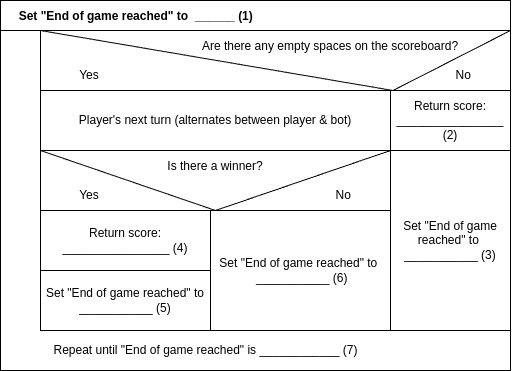
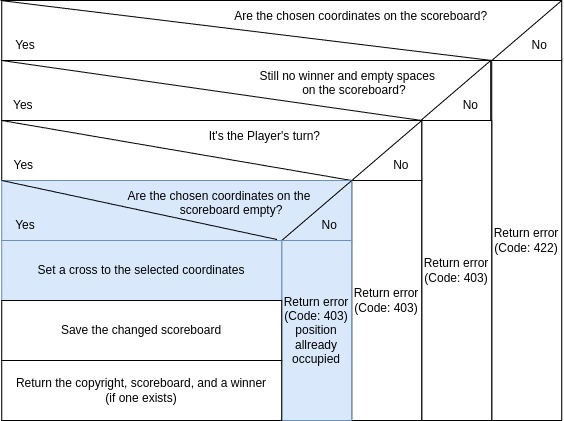

# Apprenticeship Challenge for future Computer Science Expert Subject Area: Software Development
This Challenge needs to be solved, if you want to snatch yourself an apprenticeship at [MÜNSMEDIA GmbH](https://muensmedia.de) as an Computer Science Expert Subject Area: Software Development. 👾 🤖 😎

## Tic-Tac-Toe
[Tic-Tac-Toe](https://de.wikipedia.org/wiki/Tic-Tac-Toe), noughts and crosses, or Xs and Os is a paper-and-pencil game for two players, that you're probably already familiar with.

## Gameplay / How it works
The game board consists of 9 empty spaces, aligned in a three-by-three grid.
Players alternately place the marks (:x:) and (:o:) in one of the empty spaces.

The player who succeeds in placing three of their marks in a horizontal, vertical, or diagonal row is the winner.
When no winner has been decided after all 9 spaces have been filled, the game ends in a draw.

### Example: Player X has won

### Exapmle: Draw

# Your Tasks

## 1.) Vervollständige das Struktorgramm
Ein Nassi-Shneiderman-Diagramm oder auch **Struktogramm** ist ein Diagrammtyp zur Darstellung von Programmentwürfen im Rahmen der Methode der strukturierten Programmierung.  
Ein Struktogramm besteht immer aus den nachfolgenden Strukturblöcken, die ineinander geschachtelt oder miteinander kombiniert werden können:
### Anweisung
  
Jede Anweisung (Befehlsfolge), die das Programm abarbeiten soll, wird in einen rechteckigen Strukturblock geschrieben.
### Fallunterscheidung
  
Wenn die Bedingung zutreffend (wahr) ist, wird der Anweisungsblock 1 durchlaufen.
Trifft die Bedingung nicht zu (falsch), wird der Anweisungsblock 2 durchlaufen (if then else). Ein Anweisungsblock kann aus einer oder mehreren Anweisungen bestehen.
### Schleife mit Ausgangsbedingung
  
Die Bedingung, ob Anwendungsblock 1 erneut wiederholt werden soll, wird erst nach dem Durchlauf (dem Ausführen von Anwendungsblock 1) geprüft. Daraus ergibt sich, dass Anwendungsblock 1 mindestens einmal durchlaufen werden muss.

### Struktogramm Tic-Tac-Toe vervollständigen
Wir haben begonnen ein Struktogramm für das Spiel Tic-Tac-Toe zu erstellen.  
An einigen Stellen `(1), (2), (3), (4), (5), (6), (7)` war sich dein zukünftiger Ausbilder Malte nicht sicher. **Kannst Du ihm helfen?**

*Bitte notiere Deine Lösungen und füge diese bei Fertigstellung in Deine E-Mail an uns ein.*

## 2.) Getting ready to code
Now that you know how Tic-Tac-Toe works, we want to code it.
Dont worry. No matter if you dont have eny programming experience or just a bit, we will get there together 😉
We want to see and work together on Your sourcecode. To freely share sourcecode, we are using the platform GitHub.

### Please do the following steps
- [ ] You [already own a Github-Account](https://github.com/login)  **or** you [create yourself a free GitHub-Account](https://github.com/join)
- [ ] After signing in at GitHub.com:
- [ ] Kopiere unseren Quellcode in Deinen GitHub-Account. Dazu musst Du nur den [folgenden Link klicken](https://github.com/muensmedia/testaufgabe/generate).
  - **Bitte stelle die Sichtbarkeit des neue Repositories - wie voreingestellt - auf `Public`.**
- [ ] Im neu erstellten GitHub-Repository scrollst Du herunter, bis Du diese Anleitung siehst.
- [ ] Du machst nun an dieser Stelle aus Deinem soeben erstellten Repository weiter.
- [ ] [Du öffnest Gitpod](https://gitpod.io/workspaces)
- [ ] Klicke `Continue with GitHub`, wähle `Authorize gitpod-io` und melde Dich mit Deinen GitHub-Zugangsdaten an.
- [ ] Stelle sicher, dass Du nun auf der Seite https://gitpod.io/workspaces bist.
- [ ] Erstelle durch einen Klick auf `New Workspace` eine neue Programmierumgebung.
- [ ] Wähle im sich öffnenden Dialog die Adresse Deines eben erstellten Repository aus.
- Die Arbeitsumgebung GitPod öffnet sich.
- [ ] **Wähle `Dont wait for prebuild`**
- Gitpod öffnet sich, *das kann bis zu 5 Minuten dauern 😳. Gedulde Dich.*
- [ ] Öffne **in der Zwischenzeit** https://gitpod.io/integrations
- [ ] Klicke in der Zeile `GitHub github.com` hinten auf die `drei Punkte` und dann auf `Edit Permissions`
- [ ] Wähle dann zusätzlich `public_repo` und `repo` aus und speichere mit mit `Update permissions`
- [ ] Bestätige die Änderung mit `Authorize gitpod-io` und ggf. Deinem Passwort
- [ ] Öffne dort nun diese Anleitung. Klicke dazu mit einem Rechtsklick auf die Datei `REDAME.md` und dann auf `Open Preview`.
- [ ] Fahre mit der Anleitung in Deiner Gitpod-Programmierumgebung fort.

## 3.) Copyright anpassen
Deine Tic-Tac-Toe Webanwendung besteht aus einem Frontend und einem Backend.  
Als Frontend verwenden wir das Tool `Swagger` mit dem man Schnittstellen mit einer grafischen Oberfläche einfach ausprobieren kann.  
Swagger haben wir Dir bereits im Browserfenster geöffnet.  
Als Backend verwenden wir eine [PHP-Anwendung](https://www.php.net/manual/en/) auf Basis des Frameworks [Laravel](https://laravel.com/docs/9.x).  

Wir haben eine Funktion vorbereitet, die das Copyright des Spiels ausgibt. ©️ 

**Bitte probiere die API-Methode zur Anzeige des Copyrights in Swagger aus:**
- [ ] Klicke in Swagger dazu auf `/copyright`.
- [ ] Klicke auf den Button `Try it out`.
- [ ] Sende die Anfrage indem Du auf `Execute` drückst.
- Du siehst im Abschnitt `Response body` die Antwort mit dem aktuellen Copyright.

✍🏼 **Verändere das Copyright:**  
- [ ] Öffne die Datei [app/app/App/Http/Controllers/CopyrightController.php](app/app/App/Http/Controllers/CopyrightController.php) in Gitpod.
- [ ] In Zeile `18` wird das Copyright als String gespeichert.
- [ ] Benutze den in der `CopyrightController.php` verlinkten ASCII Generator um Dein persönliches Copyright zu erstellen.
- [ ] Ersetze das Copyright `By MÜNSMEDIA GmbH` durch Dein eigenes Copyright.
- [ ] Probier Dein neues Copyright mit Swagger aus!
- [ ] Du musst Deine Änderung nun noch speichern - **committen** genannt (siehe nächster Abschnitt).

#### ✅ Commit erstellen:
  - Klicke dazu in der linken Seitenleiste auf den Reiter `Source Control` oder drücke die Tasten <kbd>Strg</kbd>+<kbd>⇧</kbd>+<kbd>G</kbd> gleichzeitig.
  - Gib oben eine Textnachricht ein, die Deine Änderung bestmöglich beschreibt. **Bitte schreibe die Nachricht auf Englisch**.
  - Speichere die Nachricht mit <kbd>Strg</kbd><kbd>⏎</kbd>
  - Klicke nun im Dialog auf `Yes`, um alle Deine Änderungen zum Commit hinzuzufügen.
  - **Klicke den Button `Sync changes`** um Deine Änderungen auf GitHub hochzuladen. Hier must Du ebenfalls mit `OK` bestätigen.
  - 🎉 Du hast Deinen ersten Git-Commit soeben gemacht! 🎊

## 4.) Methode /play schreiben
Noch kannst Du nicht gegen den vom MÜNSMEDIA-Team programmierten Bot spielen.  
Es fehlt noch die Logik, was bei einem Aufruf der `/play`-API-Route passieren soll.

### Struktogramm für einen Spielzug
Anbei das Struktogramm für einen Spielzug von Dir mit der Methode `play()`.

**To-do:**
- [ ] Schau Dir in Ruhe das Struktogramm für einen Spielzug von Dir an!
  - Die von Dir noch zu implementierenden Teile des Spielzugs haben wir im Struktogramm farblich hervorgehoben.
- [ ] In der Datei [app/app/App/Http/Controllers/GameController.php](app/app/App/Http/Controllers/GameController.php) in der Methode `play()` - Zeile 144 fehlt noch die Logik.
  - Bitte ergänze die fehlende Logik, wir haben Dir Hilfestellungen in Form von Kommentaren im Quelltext hinterlassen.
- [ ] Teste Deinen Spielzug in Swagger, die Funktion heißt dort ebenfalls `/play`.
- [ ] **❌ Um den Spielstand zurückzusetzen, gibt es im Swagger die Methode `DELETE /board`**
- [ ] ✅ Erstelle einen Commit (siehe oben `Commit erstellen`)
- [ ] 🔁 Klicke den Button `Sync changes` um Deine Änderungen auf GitHub hochzuladen.

## 5.) Der 🤖 spielt - /play-bot
Wir haben bereits einen 🤖 (Bot) geschrieben, gegen den Du spielen kannst.  
Öffne dazu Swagger und verwende im Wechsel (Du beginnst) die `/play`-API-Route und die `/play-bot`-API-Route.

## 6.) Cheaten verboten - <kbd>↑</kbd><kbd>↑</kbd><kbd>↓</kbd><kbd>↓</kbd><kbd>←</kbd><kbd>→</kbd><kbd>←</kbd><kbd>→</kbd><kbd>B</kbd><kbd>A</kbd>
Aktuell kannst Du oder der Bot noch mehrmals hintereinander spielen, obwohl ihr nicht an der Reihe seid.  
So macht das natürlich keinen Spaß 😞! 

**To-do:**
- [ ] In der Datei [app/app/App/Http/Controllers/GameController.php](app/app/App/Http/Controllers/GameController.php) in der Methode `isAllowedToPlay()` - Zeile 121 fehlt noch die Logik.
  - Bitte ergänze die fehlende Logik, wir haben Dir Hilfestellungen in Form von Kommentaren im Quelltext hinterlassen.
- [ ] Teste deine Änderung in Swagger ausführlich
- [ ] ✅ Erstelle einen Commit (siehe oben `Commit erstellen`)
- [ ] 🔁 Klicke den Button `Sync changes` um Deine Änderungen auf GitHub hochzuladen.

## 7.) Wer hat gewonnen? 🏆
Aktuell kann das Spiel noch keinen Gewinner ausgeben.  
Es ist an Dir das zu ändern.

**To-do:**
- [ ] In der Datei [app/app/App/Http/Controllers/GameController.php](app/app/App/Http/Controllers/GameController.php) in der Methode `whoHasWon()` - Zeile 104 fehlt noch die Logik.
  - Bitte ergänze die fehlende Logik, wir haben Dir Hilfestellungen in Form von Kommentaren im Quelltext hinterlassen.
- [ ] Teste deine Änderung in Swagger ausführlich
- [ ] ✅ Erstelle einen Commit (siehe oben `Commit erstellen`)
- [ ] 🔁 Klicke den Button `Sync changes` um Deine Änderungen auf GitHub hochzuladen.

## Zusatzaufgaben
Dir hat das alles großen Spaß gemacht und Du willst noch mehr, kein Problem 😈!

### 8.) Methode someoneHasWon() verschönern ✨
Die Method `someoneHasWon()` in der Datei [app/app/App/Http/Controllers/GameController.php](app/app/App/Http/Controllers/GameController.php) ist ziemlich hässlich.  
Kannst Du die Methode durch den Einsatz von Schleifen deutlich vereinfachen?  
Dazu kann es hilfreich sein, wenn Du Dir die **public-Methoden** des `$game` anschaust:
[app/app/Components/GameBoard/GameBoard.php](app/app/Components/GameBoard/GameBoard.php)

**To-do:**
- [ ] Verschönere die Methode `someoneHasWon()`
- [ ] Teste deine Änderung in Swagger ausführlich
- [ ] ✅ Erstelle einen Commit (siehe oben `Commit erstellen`)
- [ ] 🔁 Klicke den Button `Sync changes` um Deine Änderungen auf GitHub hochzuladen.

### 9.) 4x4 Tic-Tac-Toe 😈
Überlege Dir, was Du verändern müsstest, damit wir ein 4x4 Tic-Tac-Toe spielen können.  
Schau dir dazu auch die Klasse [app/app/Components/GameBoard/GameBoard.php](app/app/Components/GameBoard/GameBoard.php) genauer an.

**To-do:**
- [ ] Versuche ein 4x4 Tic-Tac-Toe lauffähig zu bekommen
  - Insbesondere Zusatzaufgabe 7.) wird dazu notwendig sein.
- [ ] Teste deine Änderung in Swagger ausführlich
- [ ] ✅ Erstelle einen Commit (siehe oben `Commit erstellen`)
- [ ] 🔁 Klicke den Button `Sync changes` um Deine Änderungen auf GitHub hochzuladen.

# ➡ Wie geht es weiter?
Sende uns die Lösung zu Aufgabe 1 sowie den Link zu Deinem Github-Repository per E-Mail, sobald Du fertig bist.  
Wir werden Deine Lösung auswerten und Dich zu einem persönlichen Kennenlerngespräch einladen, sofern Du unter die besten 5 Bewerber*innen kommst.

Wir freuen uns auf Dich!
